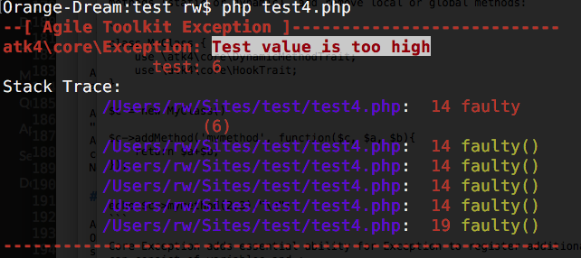

# Agile Core

**Collection of PHP Traits for designing object-oriented frameworks.**

Code Quality:

[](https://travis-ci.org/atk4/core)
[](https://codeclimate.com/github/atk4/core)
[](https://styleci.io/repos/57242416)
[](https://codeclimate.com/github/atk4/core/coverage)
[](https://codeclimate.com/github/atk4/core)

Resources and Community:

[](http://agile-core.readthedocs.io/en/develop/?badge=develop)
[](https://gitter.im/atk4/dataset?utm_source=badge&utm_medium=badge&utm_campaign=pr-badge&utm_content=badge)
[](http://stackoverflow.com/questions/ask?tags=atk4)
[](https://forum.agiletoolkit.org/c/44)

Stats:

[](https://packagist.org/packages/atk4/core)
[](https://packagist.org/packages/atk4/core)

Working on your own framework? Here you can find some useful and lightweight traits for your code:

 - Containers: Implements Parent/Child relations between your objects
 - Hooks: Create hooks and register callbacks with priorities and arguments
 - Initializers: Automatically execute init() method of your object
 - Dynamic Methods: Add methods dynamically into existing objects
 - Factory: Specify class name as a string
 - App Scope: Inject global "app" object and pass it to new objects
 
## Install from Composer

```
composer require atk4/core
```

## Sample Use

By giving "ContainerTrait" to your "parent" class and "TrackableTrait" to all possible children of your "parent", you can instantly implement the ability to create hierarchies. This is useful if you're defining named elements such as "fields" inside a "form". Automatic name detection, tracking, removal of elements, iterating through elements and more.

```
class MyParentObject {
    use \atk4\core\ContainerTrait;
}


class MyChildClass {
    use \atk4\core\TrackableTrait;
}


$parent = new MyParentObject;

$parent->add(new MyChildClass(), 'foo-bar');

var_dump( $parent->getElement('foo-bar') );
```

Hook trait allows you to define "hooks" in your object. By calling addHook() you can register callbacks which will be executed when hook() is next called. Hooks support arguments, priorities, early termination and other useful features.

```
class MyClass {
    use \atk4\core\HookTrait;

    public function doWork()
    {
        $this->hook('beforeWork');
        
        echo "Doing work\n";
        
        $this->hook('afterWork');
    }
}


$c = new MyClass();
$c->addHook('afterWork', function() { 
    echo "HOOKed on work\n"; 
});
$c->doWork();
```

With dynamic methods, you can utilise `__call` method in collaboration with internal hook system to dynamically add methods inside your object. Dynamic methods behave just like regular ones, but you can register them during run-time. Your code can check for existence of methods (static or dynamic), add remove local or global methods:

```
class MyClass {
    use \atk4\core\DynamicMethodTrait;
    use \atk4\core\HookTrait;
}

$c = new MyClass()

$c->addMethod('mymethod', function($c, $a, $b){
    return $a+$b;
});


echo $c->mymethod(2,3)."\n";
```

Core Exception adds essential ability for Exception to register additional information than can consist of variables. This can also be used for localizing your exceptions or ability to show more / less information depending on your debug level. Exception comes with a getColorfulText() that uses colorful console output to display your error nicely:



```
use atk4\core\Exception;

function faulty($test) {
    if ($test>5) {
        throw new Exception([
            'Test value is too high',
            'test'=>$test
        ]);
    }

    return faulty($test+1);
}


try {
    faulty(1);
} catch (Exception $e) {
    echo $e->getColorfulText();
}
```

For full documentation: [http://agile-core.readthedocs.io/](http://agile-core.readthedocs.io/)


## Planned Features

 - Implement Debug
 - Implement QuickException
 - Implement Sessions (for MVC frameworks)
 - Implement Renderable and Template (for UI frameworks)

## Past Updates

* 15 Jul: Improved test coverage, updated readme
* 04 Jul: Implemented FactoryTrait
* 21 May: Released 1.0: Implemented ContainerTrait, Trackable, Initializer, AppScope, Hooks, DynamicMethod
* 11 May: Released 0.1
* 11 May: Finished basic docs
* 27 Apr: Initial Commit
